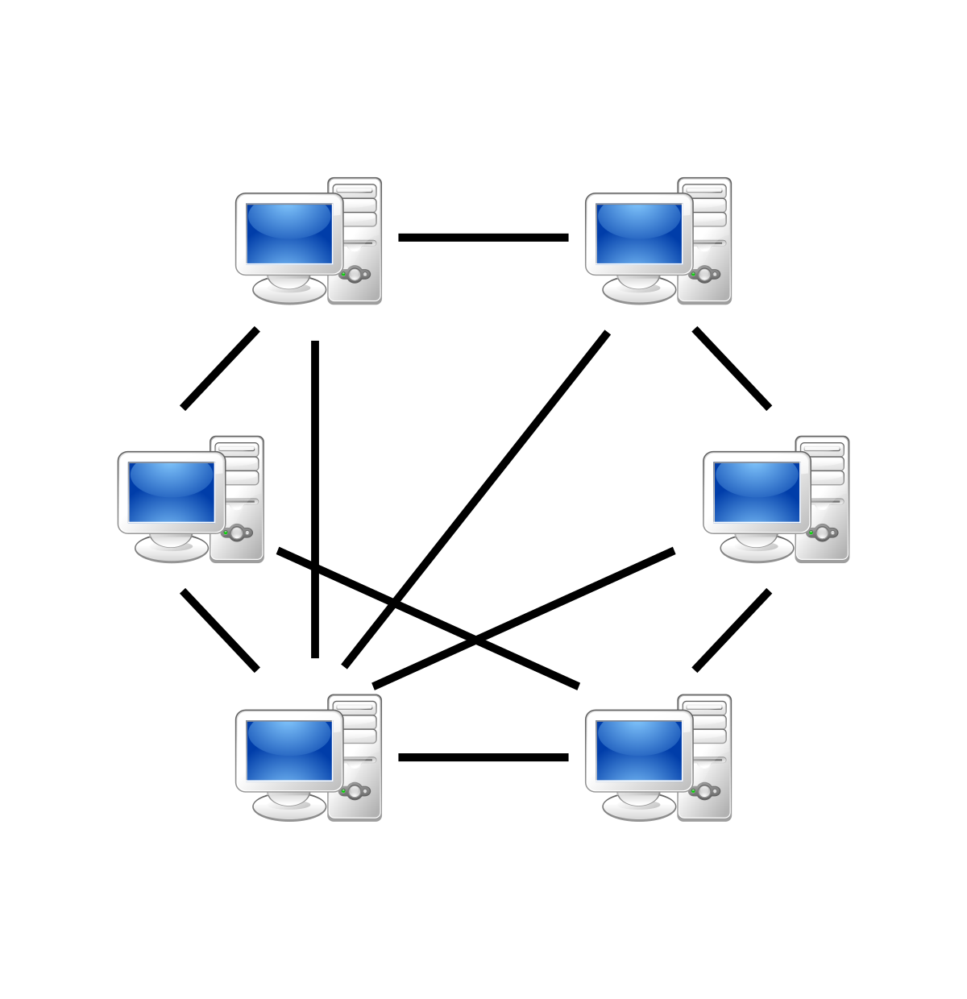
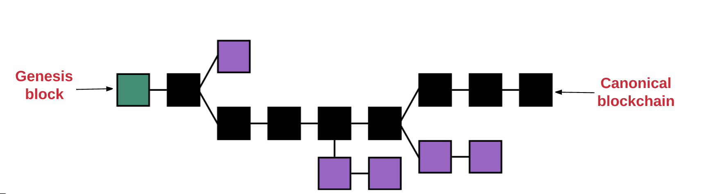

# Blockchain key concepts

<!-- .slide: class="page-title" -->

## Summary

<!-- .slide: class="toc" -->

- **[Blockchain key concepts](#/1)**
- [Ethereum basics](#/2)
- [Getting started with solidity](#/3)
- [Truffle and smart contract deployment](#/4)
- [Unit testing on Truffle](#/5)
- [D-apps](#/6)
- [More on Solidity](#/7)
- [Introduction to Oracles](#/8)
- [Smart contract security and blockchain cost](#/9)
- [What's next on Ethereum](#/10)

# Some context

Notes : Why does this technology appears ?

## Humanity, money and trust

- First barter

- Then money

- Then trusted third party

- Then fiduciary money

Notes : barter == troc
First barter : at the beginning of civilisation the most common way to exchange goods or services was by barter it with a neightboor for something of similar value.

- Then money : but the barterway become limited very quickly, and the mankind invented the concept of money. At first money has a real, physical value. People were using precious metal to forge the coins so the coin you were getting in a trade was valuable in itself.

- Then trusted third parties : this worked fine in the small scope of a village or a small kingdom. Every one knew each other directly or by a close proxy (a cousin of a cousin) and the trade worked fine, hand to hand. 
Then the scope expended with new transportation and global economy and suddently, you found yourself having to trade with a total stranger at the opposite part of the globe. A person you know nothing about and, therefore, no reason to trust at all. Trusted third parties appeared in this context. A person A want to trade with a person B, those person respectively don't trust each other.
But they know, and trust, a trusted third parties (a bank, a government, an insurance) and are able to trade with the intermediate of the trust third parties, acting as a middleman and validing the transaction on behalf of both side.

- Then fiduciary money : trusted third parties merged with money generated the concept of the fiduciary monetary system we are now living in, where the money has no real value in itself, but is still valuable because it's backed by a trusted third party (here the state and the financiary system). The problem is that, if people lose trust in the capability of the state to effectively garantee the money, the money loses all its value (as in Venezuela right now).

## Centralisation

Accumulation of wealth and power into the hand of a few single entities

Can they be trusted to act in the common good ?

Notes : during centuries trusted third parties played an escrow role in most transactions happening in the world, and got a little escrow fee for each of them. 
Not much for each of them, but given the sheer volume of transactions world wide, it turned out to be quite a big volume of money in the end.

So they became more an more rich and therefore, more and more powerful over the years 

Industrial & Commercial Bank of China : 3,6 trillion d'assets
HSBC Holdings : 2,57 trillions d'assets
JPMorgan :  $2.45 trillions d'assets
Source : https://www.investopedia.com/articles/investing/122315/worlds-top-10-banks-jpm-wfc.asp

## 2007 : financial crisis
<figure>
    
</figure>
Source : shutterstock

Notes : 
The traditional financial system flaws have been dramatically exposed in the 2007 subprime crisis.
The financial crisis turned into a full fledged world wide crisis, resulting in a large loss of trust toward this corrupt system.

## The cypherpunk movement

<figure> 
    
</figure>

Notes : 

All lot of people started thinking about another alternative system. 
Among them, the cypherpunk.

Cypherpunk : 
Derisive mix between "pyberpunk" and "cipher", cypherpunk are a informal group of people interested in cryptography. Their goal is to assert the privacy and the freedom of speech of people by dedicated use of cryptography. Julien Assange is part of it. This movement has been thinking for a long time about an alternative, decentralized economy based on technology and cryptography.

 Les cypherpunks (mot-valise composé à partir des mots anglais cipher (chiffrement) et punk sur le modèle de cyberpunk) forment un groupe informel de personnes intéressées par la cryptographie. Leur objectif est d'assurer le respect de la vie privée et de la démocratie par l'utilisation proactive de la cryptographie. Ce mouvement a longtemps réfléchi à la manière de créer une économe alternative plus décentralisée, basée sur la technologie et la cryptographie.

## Brief history of bitcoin

**1998** : B-money proposal by Wei Dai

**2005** : BitGold proposal by Nick Szabo17

**2008** : Bitcoin whitepaper

**2009** : Bitcoin release and first transaction

Notes : 
1998 : B-money = anonymous, distributed electronic cash system. introducing proof of work to create money. But it was an unrealistic proposal, not adapted to a fully distributed, unsynchronized network
Wei Dai = an intensely private computer engineer which live in the US, worked at Microsoft and was involved in the cyberpunk movement. 

2005 : 
BitGold = Laid the basic of a blockchain by using proof of work as well as chaining the cryptograpic problem solutions together as in the Bitcoin blockchain. Stayed at the stage of whitepaper as it was never successfully implemented
Nick Szabo = computer scientist, jurist and cryptograph. Has been strongly suspected of being Satoshi Nakamoto. He also was the first to introduce the concept of smart contract.

2008 : Bitcoin whitepaper release by Satoshi Nakamoto

2009 : On February 2009, he released the first implementation a few month after the publication of his whitepaper. He started generating the first bitcoin on his personnal computer and broadcast the first release on the P2P Foundation site.  The first transaction was made between Satoshi and Hal Finney, a developer at PGP corporation

2012 : Creation of the bitcoin foundation

## Satoshi Nakamoto

<figure>
    
</figure>

Notes : Satoshi is the anonymous creator of the Bitcoin protocol. He could be an individual as well as a group of people. He worked on bitcoin from 2007 to 2009. 

He will work on it, with other developpers, until 2010.
On 12 December 2010, he posted a last message giving the access of the sourceforge project and the masterkey to the head scientist of the bitcoin core team, Gavin Andersen.

Possible identity :
- Dorian Satoshi Nakamoto:  a 64 years old american, passionate about mathematics, cryptography and trains
- Nick Sazbo : computer scientist, Bitgold
- Craig Wright : australian entrepreneur, he claimed in 2016, after two investigation by Gizmodo and Wired designing him to be a credible candidate, to be the inventor of Bitcoin. He told the press he could proove his assessment making a transaction with Satoshi's private keys. But he retracted his claim soon after saying that he wasn't ready to go public yet...sig.
- Elon Musk : no reason at all, but he is such a genius
- Chuck Norris : no doubt he invented Bitcoin, or killed its creator to take his private keys.

## What's so exceptional about bitcoin ?

- decentralized consensus

- open consensus

Notes : Satoshi Nakamoto managed to solve two problem with bitcoin :
-  how to get all the network node to agree upon a shared registry in a decentralised way,
- how to allow anyone to be a part of the consensus process while being sybil-attack resilient

## Blockchain and bitcoin

<figure>
    
</figure>

Notes : The blockchain is not Bictoin. Bitcoin is a blockchain, the first blockchain actually, but one among several hundred now.

## Blockchain explosion

- **2011** : First Bitcoin forks

- **2014** : Ethereum (AKA blockchain 2.0)

- **2015** : The trust machine (the Economist Article)

- **2018** : Tech Explosion and Speculation

Notes : 
Created along with Bitcoin in 2008, Blockchain stayed in Bitcoin shadow for several years, becoming a popular topic around 2015 when it made the cover of a serious newspaper called 'The economist', reaching  a far larger and richier audience than previously.

Since then it has been a huge buzzword in the tech community and the R&D on blockchain has been fueled with a lot of investor money, turning this field into a very dynamic but speculative one. 

## Blockchain : the internet of value

Internet -> Sharing informations

Blockchain -> Sharing value

Notes : Internet offered us a marvellous way to share content and informations around the world.
Blockchain will do the same with transactions.
Every time someone need to trade with another unknown person, instead on relying on a phyiscal, central third party, he will rely on a blockchain system that generate the trust needed, in a decentralized fashion

## Blockchain definition

Blockchain is a technology composed of two parts

- an "append-only" data structure that contains data records (facts) that are cryptographically linked together,

- an consensus mecanism allowing multiple distributed parties to agree on those facts order and validity based on shared consensus rules.

Notes : Introduction : 
Blockchain technologies are so versatile right now that it's difficult to provide a one-size-fit-all definition

## Distributed Ledger Technology

- *1500+* different cryptocurrencies

- *100+* blockchains

- Some of then without blocks

~~Blockchain~~ => *D*istributed *L*edger *T*echnology

Notes : Currently there are about 1.5 thousand different cryptocurrencies and a lot of them are trying to improve on one or several limitation of the bitcoin technology. This is resulting on more than an hundred disctinct blockchains, some of them not even based on a "block" structure. Hence the new appelation of Distributed Ledger Technology

## Sum-up

A blockchain provides : 

- the storage and transmission of facts between peers
- an transparent and auditable registry
- an immutable registry
- a trustable registry given that the facts veracity and order are determined by a consensus

# Technical Prerequisite

# Asynchronous cryptography

## Goal 

Used in blockchains to :

- check data integrity

- anonymize transactions

- optimize disk space

- digital signature

Notes : Cryptography went from being about securely transporting secret codebooks around the world to being able to have provably secure communication between any two parties without worrying about someone listening in on the key exchange.
It's used extensively in blockchain technology

## Cryptographic hash function - Definition

<!-- .element class="alert alert-info"-->
A hash function is a function that take any given string input, and calculate a fixed lenght string result called the hash (or digest or fingerprint).

<!-- .element style="margin-top:50px"-->
This function has the following properties : 

- **repeateable** : always give the same result for a given input string

- **collision resistance** : the probably of two output being the same for two differents inputs must be given  two input strings the generated hashes should be differents

- **one way** : easy to compute but impossible to revert

- **look random** : deterministic yet random-looking output

Notes : add schemas to explain better ?

## Hashing function : existing hashing function

- **MD5** : use to get a digital footprint of a file

- **SHA-2** (SHA-224, SHA-256, SHA-384, SHA-512) : NSA standards, products hash of fixed X bits (256 for SHA-256) length

- **SHA-3** : aussi appelé Keccak, utilisé par Ethereum

## Hashing function : Usage

- Digital signature
- Encryption
- Data verification
- Merkle tree

Notes : Ethereum use Ethash as mining algorithm, which use sha3_256 and sha3_512 hashing algorithm

## Asynchronous cryptography in blockchain systems

Blockchain system make extensive use of asymmetric cryptography.

It's use almost everywhere nowadays for : 

- communication between two peoples thought insecure channels

- **digital signature**

Notes : used mostly for digital signature in blockchain

## Public and private keys

Two keys, generated by ECDSA or RSA algorithm, mathematically linked together.

- **public keys** : 
  - broadcasted to the network,
  - identify a user in every transactions.

- **private key** : 
  - very sensitive data, 
  - known only from the user,
  - must be kept secret at all cost.

## Collision in an address generation 

A collision is highly unlikely in addresses generated with ECDSA.

Keys are *256* bit in length and are hashed in a *160* bit address (2^160th power).

<!-- .element class="alert alert-info"-->
 *215,000,000,000,000,000,000,000,000,000,000,000,000* **addresses / people on earth** 

## Brief history of ECDSA

- **1976** : concept presentation 

- **1978** : first proof of concept RSA

- **1985** : elliptic curve usage in cryptography is suggested by Neal Koblitz et Victor Miller 

- **1992** : Elliptic Curve Digital Signature Algorithm

Notes : 
Concept : Whitfield Diffie and Martin Hellman presented it to the public in the National Computer Conference in 1976, Ralph Merkle has made the same discovery at about the same time
RSA : Ronald Rivest, Adi Shamir et Leonard Adleman
EDCSA : proposed by Scott Vanstone for digital signatures of NIST (National Institute of Standards and Technology)

## Encryption / decryption

- Encryption works by taking a message and applying a mathematical operation to it to get a random-looking number. 

- Decryption takes the random looking number and applies a different operation to get back to the original number. 

- Encryption with the public key can only be undone by decrypting with the private key.

## TrapDoor function

<!-- .element class="alert alert-info"-->
A function that is simple to process in one direction, but the reverse operation should be very difficult.

Notes : What you need for a public key cryptographic system to work is a set of algorithms that is easy to process in one direction, but difficult to undo. In the case of RSA, the easy algorithm multiplies two prime numbers. If multiplication is the easy algorithm, its difficult pair algorithm is factoring the product of the multiplication into its two component primes. Algorithms that have this characteristic — easy in one direction, hard the other — are known as Tra door Functions. Finding a good Trapdoor Function is critical to making a secure public key cryptographic system. Simplistically: the bigger the spread between the difficulty of going one direction in a Trapdoor Function and going the other, the more secure a cryptographic system based on it will be.

Une fonction à sens unique est une fonction qui peut être aisément calculée, mais difficile à inverser 

Exemple f(x,y) = x x y  avec x et y de grands nombres premiers est facile à calculer, mais difficile de déduire x ou y du résultat de la fonction

L'existence d'une brèche secrète permet cependant à la personne qui a conçu la fonction à sens unique de décoder facilement le message grâce à un élément d'information qu'elle possède, appelé clef privée.

## RSA

- Choose a huge number obtained by  multiplying two random prime numbers

- Choose the priv and public keys : two specially chosen numbers that are greater than zero and less than the maximum value

- To encrypt a number : you multiply it by itself pub times, making sure to wrap around when you hit the maximum.

- To decrypt : multiply it by itself priv times and you get back to the original number.

## Elliptic Curve Digital Signature Algorithm

<figure> 
    
</figure>

Elliptic Curve provide great trapdoor functions because mathematicians have not found an way to improve on the naive way to brute force this function, unlike RSA

The gains : 

- shortest key for similar security

- quickest signature and cypher operations

Notes : 

En mathématiques, une courbe elliptique est un cas particulier de courbe algébrique, munie entre autres propriétés d'une addition géométrique sur ses points.

Cool example :  You can compute how much energy is needed to break a cryptographic algorithm, and compare that with how much water that energy could boil. This is a kind of cryptographic carbon footprint. By this measure, breaking a 228-bit RSA key requires less energy to than it takes to boil a teaspoon of water. Comparatively, breaking a 228-bit elliptic curve key requires enough energy to boil all the water on earth. For this level of security with RSA, you'd need a key with 2,380-bits.

On peut montrer que l'algo utilisé dans les certificats HTTPS de google est un algo  ECDSA 

We can also show that it's a technology used in Google's http certificates.
Great explanation of RSA and Elliptic Curves here  (but too long and complex to explain here) : 
https://blog.cloudflare.com/a-relatively-easy-to-understand-primer-on-elliptic-curve-cryptography/

## Digital signature

<figure> 
    
</figure>

## Digital signature

<figure> 
    
</figure>

Notes : Daenerys generate a key pair using ECDSA algorithm :
- private key : used to sign her messages
- public keys : generated along with the private keys, public keys are mathematically paired with private keys. You can generate several public keys for each private keys.

## Digital signature

<figure> 
    
</figure>

Notes : Then Daenerys proceed on signing her message to Jon.
She passes her private key, along with her message to the ECDSA signature computation method, with provide a signature output, basically a random looking number but this number is linked to the private key and the message content.

## Digital signature

<figure> 
    
</figure>

Notes : Then Daenerys send her message and the associated signature.
Jon receive them and proceed to the verification of the signature.

## Digital signature

<figure> 
    
</figure>

Notes : Jon retrieve Daenerys public key (which is public, obviously). 

## Digital signature

<figure> 
    
</figure>

Notes : 
And he passes it along with the message and the signature to the ECDSA signature verification function, which will either validate the match between the three inputs, or invalidate it.

## Peer to peer network
<figure>
    
</figure>

Notes : a network model close to client-server but in which each client is also a server.
The data are communicated directly from one client to another, without transiting though a central server.
To be a part of a peer-to-peer network each member (usually called node), have to install a piece of software. In the blockchain ecosystem, those softwares are usually called wallet. 

## Peer to peer advantages

- ease data sharing

- resistant to censorship, governement or piracy attack

- high disponibility

## Peer discovery

<figure>
    
</figure>

https://www.safaribooksonline.com/library/view/mastering-bitcoin/9781491902639/ch06.html

Notes : In case of Bitcoin, for example, when a node start for the first time, it searches its own external ip adress, then it ask the DNS on several hardcoded DNS adress like :
- seed.bitcoin.sipa.be
- dnsseed.bluematt.me

Then, these address contains a list of known bitcoin node and are used by the new node to discover its network.
The node will contact each node by sending its address, and then requiring a list of all the other nodes it knows.

# More on blockchains

## Blockchain structure

<figure>
    
</figure>

## Blockchain structure

<figure>
    
</figure>

## Blockchain structure

<figure>
    
</figure>

## Blockchain structure

<figure>
    
</figure>

## Back to basics : buying a pizza with Bitcoin

<figure>
    
</figure>

Notes : 
A buyer want to buy a pizza from a seller with his bitcoins.

## Prerequisite

<figure>
    
</figure>

<!-- .element style="margin-top:0px"-->
- Both the buyer and the seller have to install a bitcoin wallet.

<!-- .element style="margin-top:-10px"-->
- The seller keep a daily update of its pizzas' bitcoin prices.

## Seller gives his public address

<figure>
    
</figure>

Notes : 
1) The seller S show his public key to the buyer B, usually, it's a QR code.

2) The buyer scan this qr-code and compare the address with the seller address (his public key) to make sure the address is alright.

3) The buy tell the wallet how much he is willing to give to the miners for his transaction to be processed. Those are the transaction fees. The more fees you give, the more quickly your transaction will be integrated in the blockchain.

## Wallet creates a transaction

<figure>
    
</figure>

Notes : 4) Then he send, on his wallet, the amount of bitcoin asked to the seller.
At this stage, the seller mustn't give the pizza to the buyer, because this operation hasn't been integrated in the blockchain.

5) To perform this operation the wallet is doing several things :
- he checks all previous transaction received and made by B  to get the amount of Bitcoin B possesses,
- if B doesn't have the money, the wallet will block the operation,
- then, the wallet is creating a transaction of X bitcoin (it's a little more complicated than that but we will see this later) from B public key to S public key (scanned previously)

## Transaction signature

<figure>
    
</figure>

Notes :
5) The wallet uses B private key and the transaction content to sign the transaction using ECDSA algorithm.
The signature is included in the transaction.

## Transaction sending

<figure>
    
</figure>

Notes : 
6) The signed transaction is broadcasted to all the nodes the wallet knows of.

## Transaction verification

<figure>
    
</figure>

Notes : 
7) Only the miners will react to a new transaction (full nodes will check new blocks, not individual transactions).

When a miner receive the signal from the wallet that it made a the new transaction,
and if the miner doesn't already know of this transaction, it ask for its datas to the signaling node.

The verification step is as follow : 
- check that the bitcoins used in the transaction belong to the sender
- check that they haven't been spent in another transaction,
- check that the transaction signature is matching to assert that 
  - the transaction content hasn't been changed in any way
  - the transaction have been issued by the sender

Once he gets it,  he verifies it, and if it checks, it broadcast the new transaction in turn to all its known peers.
That's how an unconfirmed transaction is sent to the whole network.

## The need for a consensus algorithm

*Problem :* 
Unconfirmed transactions :

- coming from all over the world

- not received by miners in the same order (network latency)

- some of them can be dishonest 

<!-- .element style="margin-top:50px"-->
But the system has to be able to : 

- verify that the transactions is legit

- create a consensus on how the transactions will be ordered in the replicated ledger common to all nodes.

<!-- .element style="margin-top:50px"-->
*Solution :* the consensus algorithm, called *Proof-of-work* in Bitcoin

## Proof-of-work miners

<figure>
    
</figure>

Notes : 
Among the peers receiving the transaction, their are the miners.

## Miners role

<!-- .element style="text-align:center"-->
**100 000 miners worldwide** (estimation)

<!-- .element style="margin-top:50px"-->
A miner : 

- verify unconfirmed transaction
- create a consensus on the network about transactions orders
- make it costly to attack the blockchain
- get paid to secure the network

Notes : 
Estimation made by an australian researcher called Andrew Geyl 

## Transactions ordering : candidate blocks

<figure>
    
</figure>

Notes :
All the 100 000 miners are working concurrently.

One by one, they pick an unconfirmed transaction, verify it, and add it to its candidate block, until the candidate block has reached the maximum size.

The transaction are ordered inside the block.

Once the miner has finished building its candidate block, he will try to impose its block to the network as the next block of the ledger.

## Proof of work : a lottery

<figure>
    
</figure>
Notes : a good metaphor is to compare POW to a lottery whose goal is to select the next block to integrate the blockchain among all the miner's candidate blocks.

## Proof of work : hash cash

<figure>
    
</figure>

Notes : To do so, the POW algorithm forces the miner to solve a cryptographic problem in order to validate its block.
A block is composed of all transactions + a header.
This header contains severals technicals fields :
- the merkel tree root : a hash of all the transactions contained in the block
- the nonce : a POW counter, we will see it soon
- a timestamp : indicate the date of the block
- the version : indicate which set of block validation rules the block follow
- nBits : the difficulty of the block

## Proof of work : hash cash

<figure>
    
</figure>

Notes : 

In the bitcoin case this puzzle is the following : 
- the miner has to hash the header of its candidate block

## Proof of work : hash cash

<figure>
    
</figure>

Notes : 
- then, he hash the resulting hash (two subsequent hash operation for security reasons).

## Proof of work : hash cash

<figure>
    
</figure>

Notes : 
Here is the trick : the obtained hash must be inferior to a number decided by the protocol for the block to be valid. This number is called the target we will get back to it later. The target number is a fairly low number so it's mean that the hash will have to start with a definite number of O (17 in the current difficulty). 

## Proof of work : hash cash

<figure>
    
</figure>

Notes : 
If the miner doesn't successed, he updates a field in its candidate block, called the nonce, and tries again. 

Nonce : a counter which shows how many time the miner has tried to mine the block before finding a solution

## Proof of work : hash cash

<figure>
    
</figure>

Notes : This goes on until a hash satisfing the protocol rules is found.
This is so difficult that only a miner among all the miners will manage to find such a hash in 10 minutes time. It is its block that will be selected.

## Difficulty & targets

**Difficulty :** humain readable target 

<!-- .element style="margin-top:50px"-->
**Target on May 2018 :** 000000000000000000415a490000000000000000000000000000000000000000

<!-- .element style="margin-top:50px"-->
**Original target :** 0x00000000ffff0000000000000000000000000000000000000000000000000000

<!-- .element style="margin-top:50px"-->
Difficulty = original_target / target
           = 4,306,949,573,981.51

<!-- .element style="margin-top:50px;text-align-center;"-->
**Meaning : it's now 4,306,949,573,981.51 times more difficult to mine a block now than it was on the first block**

Notes : The target is a 256-bit number (extremely large) that all Bitcoin clients share. The difficulty is relatively small compare to the max possible number represented by a hash. So what it means is that the candidate block header double hash must begin with a specific number of zeros to be lower than the target. This number of zeros depends on the difficulty setted by the network. This difficulty is adjusted every 2016 blocks (around two weeks time) to adapt to the current hasrate ( number of hash operations performed by all miners / second). This difficulty is finely tuned in order for a block to be mined approximately every 10 minutes, notwithstanding the number of miners currently on the network. 
Sources : http://learnmeabitcoin.com/glossary/target

## One miner find a solution

The lucky winner gets to : 

- add its candidate block at the end of the chain

- receive all transactions fees

- receive the block reward (some Bitcoin created by the protocol)

Notes : 
It can take several billions tries to a miner to get this right.
One of them will manage to solve the problem every ten minutes.

He will get the block reward (some Bitcoins created from thin air by the protocol to reward the miners, this reward is halved every 210,000 blocks) and also receive the fees of all the transaction in its block.

## The new block is broadcasted to network

The new found block will then be broadcasted to the network and each node will :

- test it locally to check if the block is valid (all transactions in it are legit and the block header hash respect the current target),

- integrate it to their own local ledger,

- if the node is a miner, he will drop all computations on his previous candidate block  and restart the whole process with a new candidate blocks based on the newly-reveived block. 

## Pizza transaction over !

<figure>
    
</figure>

Notes : Once the seller wallet will have included the block in its ledger, it will inform the seller that the transaction is validated, and the seller will be able to give his pizza to the buyer knowing that the money have been successfully transferred.

In the case of a more important transaction where big sums are at stake, the seller usually wait for the newly mined block to be covered by 5 other blocks, in order to avoid a double spend attack.

# Demo : A block explorer

Notes : 
Show the content of a block, how they are chained,
the input and outputs of a transaction.

# Blockchain Governance

## Blockchain typology

Peer to peer network composed of : 

- full nodes

- lightweight nodes

- miners

<!-- .element style="margin-top:100px"-->
The distinction between those members is made by the wallet they use.

## Wallet : full nodes

<figure>
    
</figure>

Notes : when you want to install a blockchain node on your workstation, you will have to install a software which is often called a wallet.
When you choose a wallet, you have two options : 
- full node 
- lightweight node 
A full node is the recommanded software for a blockchain because it's the most decentralized option. 
A full node wallet contains : 
-  a full node : the piece of software that received all the new blocks of the network, validate them, and store them locally. 
When a full node boots for the first time, it usually download all the blocks since the beginning of the blockchain and verify each transactions in them. It's a ver long process.
- a keystore (the wallet part) : the keystore is the place where all the private/publics keys pairs of the accounts owned by the user are stored. 
- a mining package  : if you want to provide power or stake to protect the blockchain and be rewarded for it, you can activate the miner/validation part of your node to start securing the network. We will detail these process later on. 

## Wallet : Lightweight nodes

<figure >
    
</figure>

Notes : 
- lightweight node :
it contains only the keystore and the transactions related to these keys.

## Installation of a lightwallet

<!-- .slide: class="page-demo" -->

Notes : Electrum pour Bitcoin par exemple
Show the key generation process
Show the send and received part
Explain that the launching of the app is relatively quick as it does not download all transactions

## Lightweight node and decentralisation

<figure>
    
</figure>

Notes : To track them, it still need to get informations from the rest of the network
A lightweight node still need to synchronize with a full node to get its information. It's clearly less decentralized as you are relying on a set of full nodes to get your informations and if those node get corrupted, your lightweight wallet get corrupted too.

# Blockchain fork

## Forked blockchain 

<figure> 
    
</figure>

<!-- .element style="text-align:center;color:Gainsboro"-->
Source : medium.com/@preethikasireddy/how-does-ethereum-work-anyway-

## Heaviest chain 

<figure> 
    
</figure>

<!-- .element style="text-align:center;color:Gainsboro"-->
Source : medium.com/@preethikasireddy/how-does-ethereum-work-anyway-

## Natural fork example

<figure>
    
</figure>

Notes : Consider the last mined block of the blockchain, here called N.

## Natural fork example

<figure>
    
</figure>

Notes : In a POW blockchain, a block is supposed to be mined every X minutes. But it's a random process. Sometimes it can take 2 minutes, other time 20 minutes, the most important thing is that it should be 10 minutes, on average on a given time period.
Because of this randomness, sometimes, two miners can effectively mine a block at about the same time. When this happens, the network experiences a 'natural' fork.
Both successfull miners send their valid block to the rest of the network. So all the network nodes will get either block N+1 or block N+1' first, and they will start to mine their candidate block which will included the hash of N+1 (respectivily N+1'). They will ignore the other block N+1' (respectivily N+1), received later, for the time being.

## Natural fork example

<figure>
    
</figure>

Notes : So at one point, when all the network miner will have choose one of the two blocks and the mining power will be divided between those who choose the block N+1 and those who choose the block N+1'.
The winner will be decided based on the mining power behind the competiting blocks.
In this case the block N+1 has been received first by 60% percent of the miners, so...

## Natural fork example

<figure>
    
</figure>

Notes : The next block will likely be build on it. This will solve the fork because when this next block N+2 is broadcasted to the other node, the one's still working on the fork of the N+1' block will abandon their current candidate block and start working on another block base on the N+2 block. Therefore, the conflict will be solved.

 The other block will be marked as orphaned and will be ignored by the rest of the network. The transactions in it will either be part of the majority-selected block or will return to the waiting pool. And the miner of the orphaned block won't received any reward.

## Blockchain Governance

Technical updates are made by updating the node's softwares.

<!-- .element style="margin-top:50px"-->
*Democratic :* the majory of the network node must install a new software changes.

Notes : To upgrade a blockchain protocol (change some parameters as mining time, block size ... or even something more important as replacing POW with POS), the miners have to change their softwares.
So blockchain like NEO keep a centralized governance, avoiding the risk of a fork

## Provoked fork

<!-- .element class="alert alert-info"-->
A fork happens wheh a developer want to amend the configuration or the rules of the current mining software and the change doesn't convince everyone.

They are actually three types of forks :

- hard forks

- soft forks

- user activated forks

Notes : A fork can also be proposed by a developer who wish to amend the configuration or the rules of the current mining software.

If the proposed changes win unanimous support, every miner will agree on the software, and change its software. The changes will become the new rules of the network and every miner who don't follow them will be ignored by the network.

But it's rarely such an ideal scenario.
In most case, a significant part of the miners disagree with the software update and decide to stay with the current software.
This is a fork.
In that case, the mining ressources will be divided into two factions : the ones that support the fork and the ones that don't.

## Hard fork

<figure>
    
</figure>

- Miners only

- Uncompatible software

- Split the network in two separate chains : 

  - one who agrees with the change

  - those who don't

Notes : The software upgrade introduces a new rule to the network that isn't compatible with the older software (A new rule that allows block size to be 2MB instead of 1MB would require a hard fork).

What happens? Nodes that continue running the old version of the software will see the new transactions as invalid. So, to switch over to the new chain and to continue to mine valid blocks, all of the nodes in the network need to upgrade to the new rules.

Therefore two chains will be created based on a common history, and the mining power of both network will be divided (hence degrading the security of the blockchain).

The ethereum DAO hard fork was a perfect case study of how a community can split over rules. Now, we have two blockchains using a variant of the software - ethereum and ethereum classic, both of which boast a different ethos and a different currency.

## Soft fork

- Miners only

- Retrocompatibles changes

- New mined blocks accepted by the old miners

- But the reverse is not true

- Will work only if the majority adopt the software change

Notes : This happen when the proposed changes are retrocompatibles.
In this case the blocks mined by the updated nodes will be accepted by the old ones. But the blocks mined by the old software miners won't be accepted by the updates nodes.
This will end well if the majority of the miner update their software. If not, the soft fork chain will become the shortest and be ignored.

## User activated fork

Fork mode which is giving power to all the full nodes and not just the miners

Notes : This kind of fork is still a theory.
What is it? A user-activated soft fork (UASF) is a controversial idea that explores how a blockchain might add an upgrade that is not directly supported by those who provide the network's hashing power.

The idea with UASF is that instead of waiting for a threshold of support from mining pools, the power to activate a soft fork goes to the exchanges, wallets and businesses who are running full nodes. (In bitcoin, a full node, even if it is not a mining node, is still responsible for validating blocks.)

What happens? The majority of major exchanges would need to publicly support the change before it could be written into a new version of code. After that, the new software (which has an activation point in the future) gets installed on nodes that want to participate in the soft fork.

What can go wrong? This method requires a much longer lead time to work than a hash-power-triggered soft fork. In fact, it's believed it may take as long as a year or more to write the code and get everyone ready.

Further, if the majority of miners end up not 'falling in line' and activating the new rules, they could use their overwhelming hash power to split the network.

Currently this idea is theoretical and has not been implemented.

# Consensus algorithms

## About good and bad consensus algorithm

<!-- .element style="margin-top:50px"-->
3 importants properties to evaluate its value : 

- **Safety** : all the node produces the same valid (according to the protocol) output
- **Liveness** : the nodes will always reach consensus
- **Fault tolerance** : the consensus must recover from a node failure

## POW : Remainder

<!-- .element style="margin-top:50px"-->
The double sha-256 of the candidate block must be inferior to a target number, dynamically adusted by the network. 

<!-- .element style="margin-top:50px"-->
All miners are working concurrently to be the first to solve it.

## POW : Pros 

- Strongly secured

- Expensive to attack

Notes : Working on Bitcoin since 2009, hacker-proof. 
Strongly secured : mining cost energy but it gives a intrinsic value to the mined block because if you want to hack a POW blockchain, you have to use the same amount of power.

## POW : Cons 

- Expensive
- Unrealistically energy consuming
- Tendancy to centralization
- Still vulnerable to 51% attacks
- scalability

Notes : 
Expensive : ASIC and energy are very expensive. 
Energy : bitcoin blockchain consumed the energy bill of country like Danemark in 2017. This is huge and really inefficient.
Centralization : As the mining power depends on energy and asic server, a miner in a country like China, for instance, where the energy is cheap (still choal-based), and where they build those servers, is very favored. And if you add to that the fact that asic servers are nowadays stored in huge dedidated building, where the cost are mutualize and decreased with the sheer number of servers, whethe heat is retrieve to fuel other activities and everything is designed for mining, to be cost-effective, you are in a situation where the mining power is mainly center in the hand of a few big mining group, primarely based in China (70%). 
This is a bad situation for a decentralized technology.

## POW Centralization
<figure> 
    
</figure>

<!-- .element style="text-align:center;color:Gainsboro"-->
Source : blockchain.info

## Proof of stake

<figure> 
    
</figure>

<!-- .element style="text-align:center;color:Gainsboro"-->
transformingtruth.org/pregnant-with-hope

Notes : Cardano, Neo, Stellar, EOS are proof of stake projects.

## POS : How it works

Nodes (called validators) are choosen pseudo-randomly to produce/vote on blocks.

<!-- .element style="margin-top:50px"-->
A **validator** : 

- sends an amount of the blockchain money to a vault,
- this money is locked and is called the stack,
- the more stack, he send, the more voting power he gets to select the next block,

Notes : Validators are node whose possesors had sent a deposit ( in the blockchain currency) to a vault (a smart contract). The amount of its deposit give him a percentage of chances to be selected to elect the next block. The more money the validator had staked, the more voting he gets. The money he deposited is locked (he cannot do anything with it), until he unstake it (losing his voting power in the process).

## POS : Types 

2 types of POS : 

- **On-chain POS** (Peer Coin, Qtum) : a validator is pseudo-randomly selected to choose the next block
- **Byzantine Fault Tolerant Agreement** (Stellar, Tendermint) : somes validators are elected to propose blocks, and then, all validators find a consensus on the block through a voting system. 

Notes : 
ON-chain POS : the validator gets the right to choose a block to append to the blockchain (usually at the end of the longest chain).
Byzantine Fault Tolerant Agreement :  validators are randomly assigned the right to propose blocks, but agreeing on which block is canonical is done through a multi-round process where every validator sends a "vote" for some specific block during each round, and at the end of the process all (honest and online) validators permanently agree on whether or not any given block is part of the chain. Note that blocks may still be chained together; the key difference is that consensus on a block can come within one block, and does not depend on the length or size of the chain after it.

## POS vs POW 

<!-- .element style="margin-top:100px"-->
- no need for a large amount of coins to motivate the miners
- validators get rewarded by transaction fees
- they can lost their stakes if they misbehave so 51% attacks become a lot more expensives
- nodes need to be online 24/7  (you will be sidelined a long time if you disconnect even one second)

## POS terms

<!-- .element style="margin-top:50px"-->
**Finality** : it's done, final, never revert the history

<!-- .element style="margin-top:50px"-->
**Accountable safety** : two conflicting checkpoint are impossibles

<!-- .element style="margin-top:50px"-->
**Plausible liveliness** : the validating process can't stop

<!-- .element style="margin-top:50px"-->
**Slashing** : punishing a validator who is dishonest. No double vote and no surround vote.

Notes : The validator can report each other in case of misbehavior. The reporter gets a reward after a justified report, from the reported stake, which then get burned.
Surround vote : a validator vote and disconnect from the network and vote again
Double vote : if one validator vote for two different miners at a given epoch, two checkpoints could get created at the same height

## POS : Pros

Compared to POW, it's : 

- energetically viable
- cheaper
- less centralised 

## POS : Cons

But : 

- the richest get richer
- work in progress as there are some security concerns

## POS : Nothing at stake

<figure> 
    
</figure>

<!-- .element style="text-align:center;color:Gainsboro"-->
Source : https://github.com/ethereum/wiki/wiki/Proof-of-Stake-FAQ

Notes : 
One of those concerns is the nothing at stake problem.
In POS, the validators can vote on two differents chain histories, preventing chain consensus from being reached.
A problem that can lead to double spending attack and network instability.

In a POW algorithm, if a system fork, a miner have to choose on which fork he will work, otherwise, he would be dividing its computation power between the two forks which is counterproductive.

In a basic POS stake algorithm, nothing stops the validators from voting for each forks, because once they have the voting power, it costs nothing to them.
Why would they do it ? Because validators are greedy and they gets a reward only if they vote for the block that will be elected. So voting for them all garanties that the validator will get its reward anyway.

Moreover, if 99% of the validators vote on each block during a fork, the 1% validators remaining can easily perform a double spend attempt by introducing a fraudulent transaction in a branch, and voting for the other. This way, the fraudulent transaction will be inserted in the chain at first, but will be discarded when the other branch (which will have a 100% consensus), will be validated.

# Blockchain security

## Double spend (51%) attack 

<figure>
    
</figure>

Notes : We just saw that the blockchain has a intern mecanism to solve the natural forks happening from time to time. Now let's review the case of a fork created by a group of malicious miners. 

Bob send a transaction of one coin to Jay in order to buy a pizza, this transaction has been send for a while and it has been processed and integrated in the N block. This block has been covered by two other blocks N+1 and N+2 by then.

Unfortunately, Bob is a dihonnest person and he wants to cheat Jay and buy a kebab to Brian with the same coin he just gave to Jay.
He can theoritically do this with the double spend attack.

Bob can cancel his first pizza transaction, but what it can do is trying to invalidate the block in which it has been integrated and replace it with another.

## Double spend (51%) attack 

<figure> 
    
</figure>

Notes : The transaction has been integrated in the blockchain at the N block. So Bob create a block N' integrating the hash of the N-1' block header. This new block will contain the kebab transaction, not the pizza one.

## Double spend (51%) attack 

<figure> 
    
</figure>

Notes : This attack can only work in the attacker (Bob in this case) possess at least 51% of the network mining power. This is a huge prerequisite as we will discuss later.

## Double spend (51%) attack 

<figure> 
    
</figure>

Notes : So for the sake of the argument, we will pretend that Bob manage to control at least 51% of the miners. He has now more than one chance out of two to mine the new block.

## Double spend (51%) attack 

<figure> 
    
</figure>

Notes : So logically, he will mine another block just after N', based on it. Note that it is not how an honest miner would behave, because a miner is supposed to always work on the longest fork (the one that has necessited the most working power). 
So here, the miners controlled by Bob, working on his fraudulent fork, are fighting against all the other honest miners of the network working on the longest chain.

## Double spend (51%) attack 

<figure> 
    
</figure>

Notes : But Bob is stronger than the rest (51%). So he will likely mine the next block.

## Double spend (51%) attack 

<figure> 
    
</figure>

Notes : Even if the other 49% of honest miners get lucky and mine a block.

## Double spend (51%) attack 

<figure> 
    
</figure>

Notes : Bob will still be the one who will mine most of the new blocks.

## Double spend (51%) attack 

<figure> 
    
</figure>

Notes : And  will ultimately have the longest chain. The honest miners will then consider his fork as the longest, legit chain and will start mining on it. So all the previously valid transactions included in blocks N to N+3 will be invalidated and the history will be effectively rewrited. 

## Double spend (51%) attack 

- Very expensive attack sometimes called GoldFinger attack

- You can : 
  - invalid recent transaction
  - prevent transaction from ever being validated
- You can't : 
  - impersonate another member of the network
  - create a fake transaction

Notes : 
In order to control 51% of the miners of the bitcoin blockchain, you would have to spend more than a half billion dollars in asic mining servers and electricity. This is a huge cost and this is why this attack is also called the 'GoldFinger' attack.
And even so the attacker could effectively destroy the whole network, he would likely be more incitated to behave properly to retain the value of the cryptocurrencies he will gain while mining.
But this type of attack could very likely be setup be a governement or a big company wishing to destroy a technology they could perceive as a threat.

Drawbacks :
What you can do with a 51% attack :

- rewrite some transaction in the most recent blocks (but you can theoritically rewrite any blocks you want if you keep the majority for enought time) ,
- mine empty blocks to incapacitate the network (all transactions could be prevented from being validated),
- prevent some transactions from being validated in your mined blocks

What you cannot do :

- impersonnate another member of the network : you can't spend a coin that is not your as you still don't have the private key needed,

<!-- .slide: class="page-questions" -->