# Blockchain usages

<!-- .slide: class="page-title" -->

## Summary

<!-- .slide: class="toc" -->

- [Blockchain key concepts](#/1)
- **[Blockchain use cases](#/2)**
- [Ethereum basics](#/3)
- [Getting started with solidity](#/4)
- [Truffle and smart contract deployment](#/5)
- [Unit testing on Truffle](#/6)
- [D-apps](#/7)
- [More on Solidity](#/8)
- [Introduction to Oracles](#/9)
- [Smart contract security and blockchain cost](#/10)
- [What's next on Ethereum](#/11)

# The three types of blockchain

## Public blockchains

<figure> 
    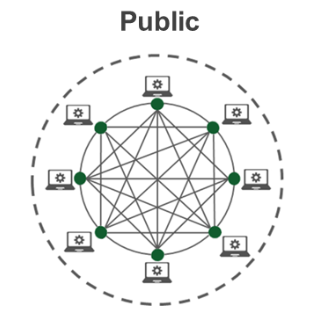
</figure>

<!-- .element style="text-align:center;color:Gainsboro"-->
Source : [Utilization of Distributed Technologies for Custom Solutions on Medium](https://medium.com/applicature/utilization-of-distributed-technologies-for-custom-solutions-public-private-and-hybrid-570a1e14852)

## Public blockchains
**Pros :**

- everyone can transact and participate in the consensus
- everyone can audit all the blockchain datas at any time
- secured by a large network

<!-- .element style="margin-top:50px"-->
**Cons :** 

- costly
- not scalable (for now)
- no data privacy

## Hybrid blockchains

<figure> 
    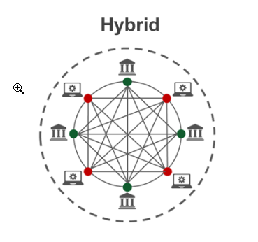
</figure>

<!-- .element style="text-align:center;color:Gainsboro"-->
Source : [Utilization of Distributed Technologies for Custom Solutions on Medium](https://medium.com/applicature/utilization-of-distributed-technologies-for-custom-solutions-public-private-and-hybrid-570a1e14852)

## Hybrid blockchains

**Pros :**

- a authorization module decides who can send transaction, participate to the consensus or read datas,
- secured channel allows users to communicate privatly,
- reduced costs,
- currently great to implement business usecases.

<!-- .element style="margin-top:50px"-->
**Cons :** 

- the authorization module is not decentralized

## Private blockchains

<figure> 
    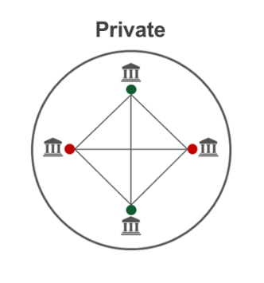
</figure>

<!-- .element style="text-align:center;color:Gainsboro"-->
Source : [Utilization of Distributed Technologies for Custom Solutions on Medium](https://medium.com/applicature/utilization-of-distributed-technologies-for-custom-solutions-public-private-and-hybrid-570a1e14852)

## Private blockchains

**Pros :**

- a central authority decides who can send transaction, participate to the consensus or read datas,
- datas are safes.

<!-- .element style="margin-top:50px"-->
**Cons :** 

- the central authority,
- a glorified database ?

# Use cases

## Banking

<figure> 
    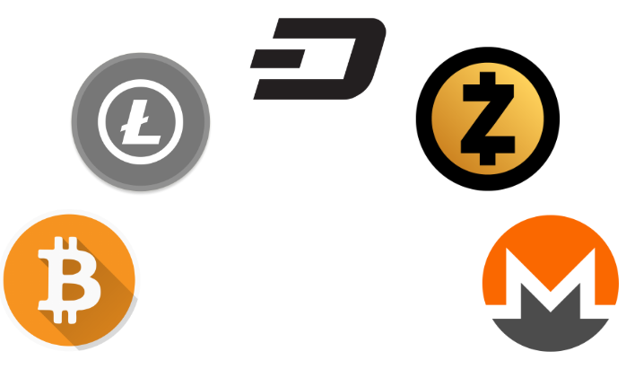
</figure>

Notes : Money systems based on cryptocurrencies will be : 
- faster
- cheaper
- honest

## Supply chain

<figure> 
    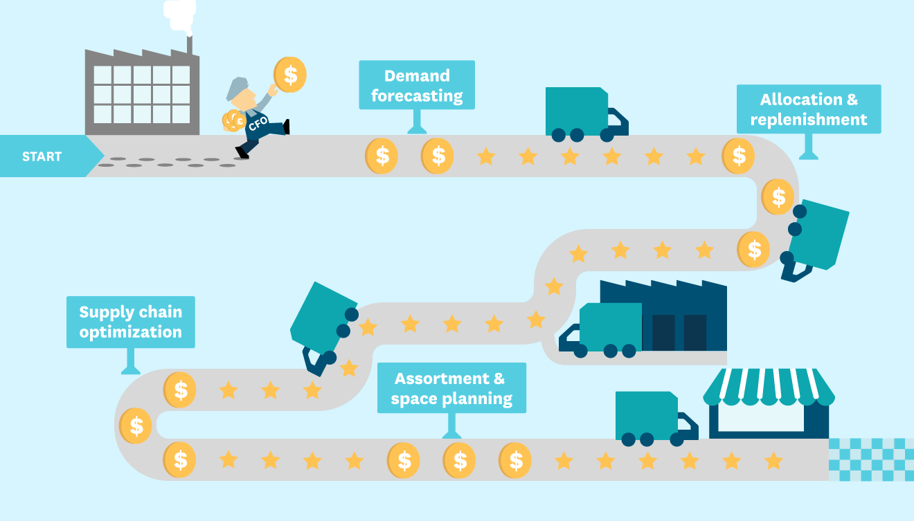
</figure>

## Social media network

<figure> 
    
</figure>

## Crowdfunding : ICOs & STOs

ICO : Initial Coin offering, the investor doesn't get any share of the compagny
 
<!-- .element style="margin-top:50px"-->
STO : Security Token Offering, the investor gets some guarantees. 

## Decentralized file storage

<figure> 
    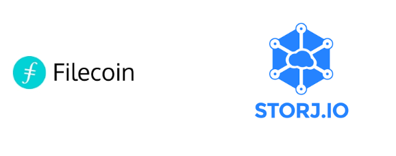
</figure>

## Voting system

<figure> 
    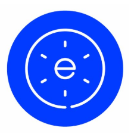
</figure>

# Is blockchain the right pick for your project ?

## The participants

<figure> 
    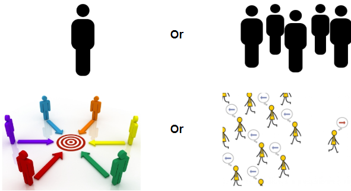
</figure>

Notes : First, there must be several participants, with a shared goal but with divergeant interests.

## The usages 

<figure> 
    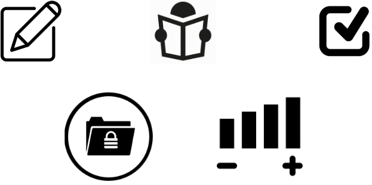
</figure>

Notes : 
Some questions : who can write or read your blockchain ? Can all your datas be transparently available for all the world to see ? 
Who will validate and control the transactions ? Do you need to store a large amount of data on the blockchain (il will cost you greatly) ?

## The types of blockchain projects

<figure> 
    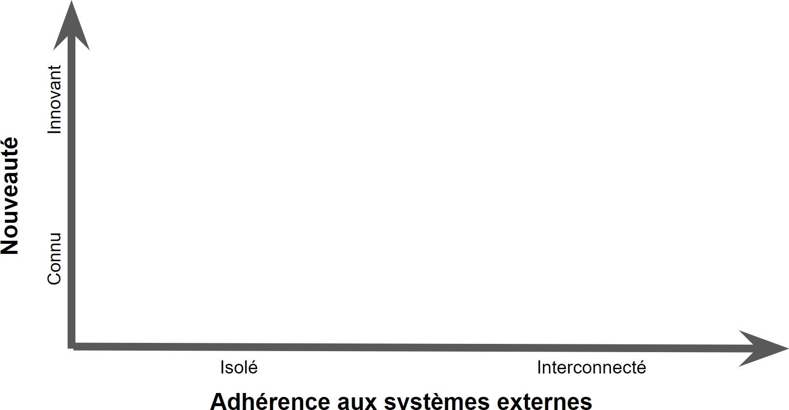
</figure>

## The types of blockchain projects

<figure> 
    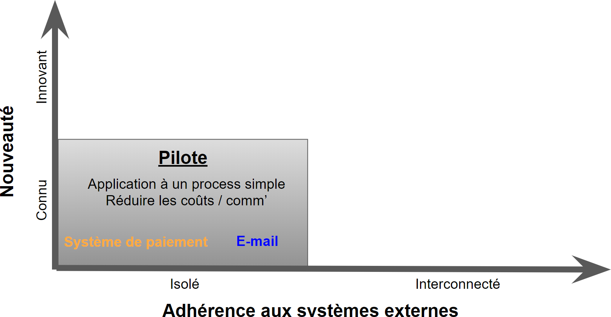
</figure>

## The types of blockchain projects

<figure> 
    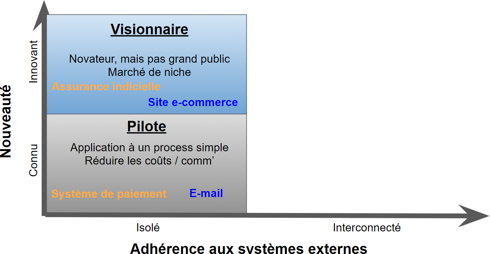
</figure>

## The types of blockchain projects

<figure> 
    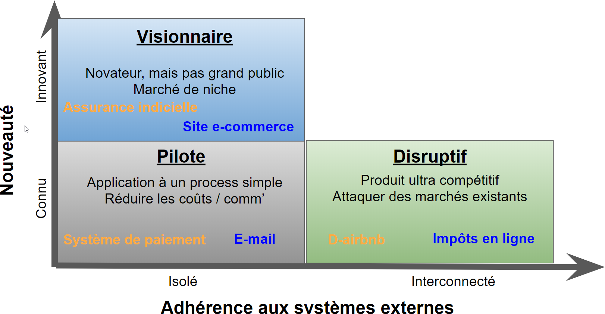
</figure>

## The types of blockchain projects

<figure> 
    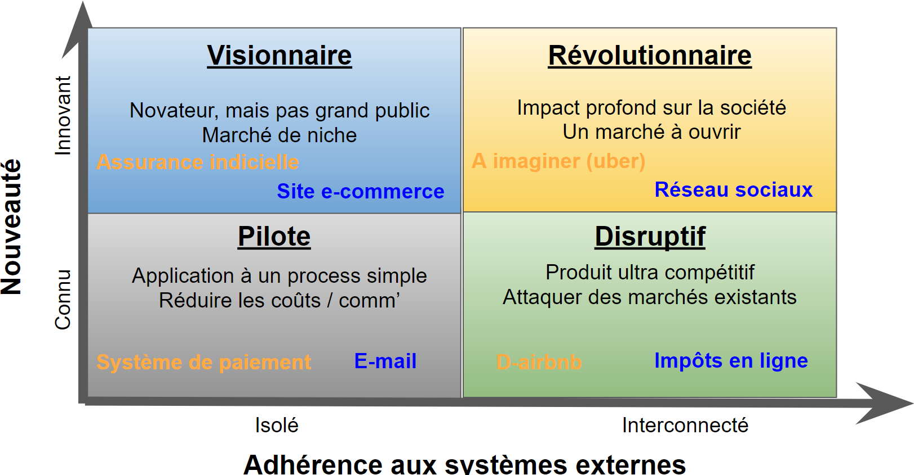
</figure>

## Blockchain canvas

<figure> 
    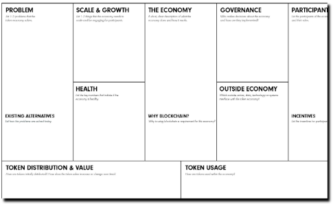
</figure>

https://blockchaincanvas.files.wordpress.com/2017/05/blockchain-canevas-vf-2016-sajida-zouarhi-cc-by-nc-sa-1-0.pdf

<!-- .slide: class="page-questions" -->

# TP : pitch your blockchain project

<!-- .slide: class="page-tp0" -->