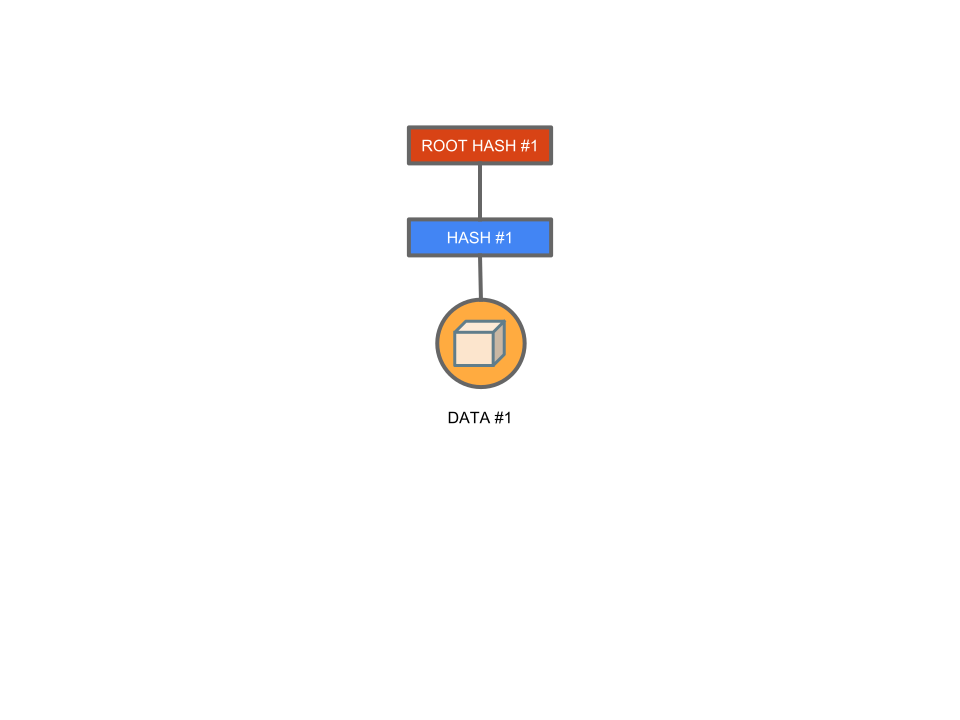
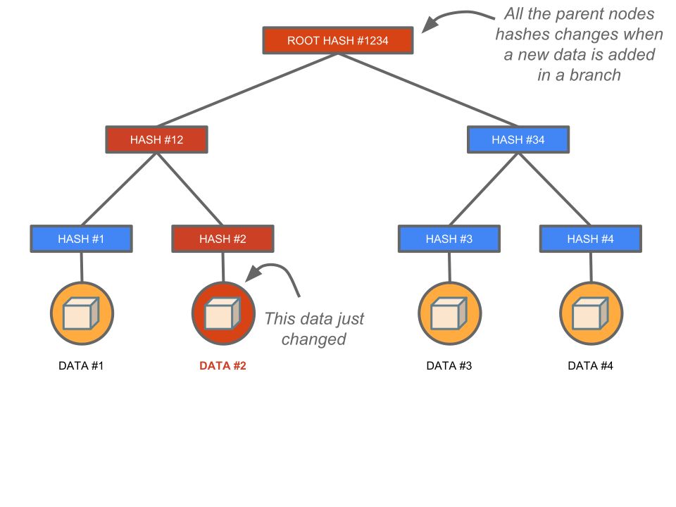
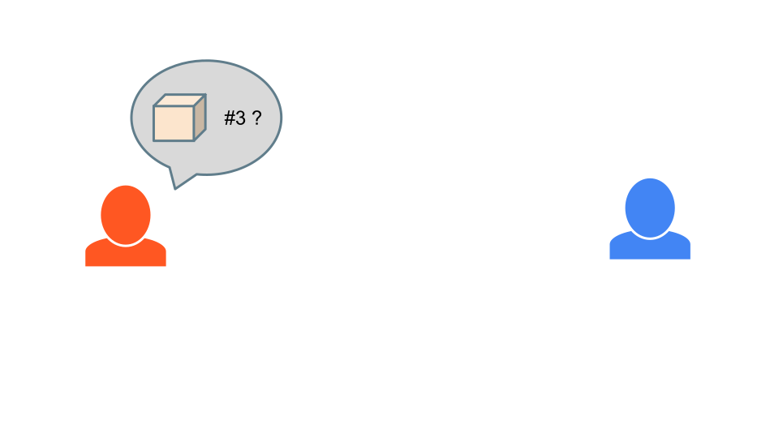

# Ethereum basics

<!-- .slide: class="page-title" -->

## Summary

<!-- .slide: class="toc" -->

- [Blockchain key concepts](#/1)
- **[Ethereum basics](#/2)**
- [Getting started with solidity](#/3)
- [Truffle and smart contract deployment](#/4)
- [Unit testing on Truffle](#/5)
- [D-apps](#/6)
- [More on Solidity](#/7)
- [Introduction to Oracles](#/8)
- [Smart contract security and blockchain cost](#/9)
- [What's next on Ethereum](#/10)

# Ethereum

## Brief history

- Described at first in a whitepaper of 2013 by Vitalik Buterin

- Aim to provide a better alternative than Bitcoin to build decentralized applications

- Core team gathered in 2014

- Successful crowdfunding in 2015

- First beta release in May 2015

- First stable release 'Homestead' in March 2016

- Ethereum Entreprise Alliance (EEA) in March 2017

- 1800 decentralized applications (D-app)

## Some numbers 

On June the 22th 2018 : 

- **10 900** : number of full nodes

- **120 GiB to 1 TB** : disk space needed to install a full node 

- **6 856 714** : longest chain lenght

- **175.1 TH/s**  : total miners hashing power

- **550 000** : number of transactions processed in 24 hours

- **14 s** : approximate block generation time

- **3 eth** : mining reward per block

## What is Ethereum ?

Whereas Bitcoin usecase is a store of value and a digital gold, 
Ethereum is a blockchain network, created to facilitate a lot of usecases :

- decentralized application (no SPOF) : a fully decentralized application cannot be shut down,

- token creation : you can quickly create your own cryptocurrency on the ethereum blockchain

<!-- .element style="margin-top:50px"-->
Ethereum provides numerous improvements over Bitcoin : 

- an (almost) turing complete scripting language,
 
- faster block confirmation,

- will, one day, I still believe, implements POS consensus algorithm

## Transaction-based state machine

<figure> 
    
</figure>

Notes :
Ethereum state begin at the genesis block, in the genesis state. And this state has been updated with each transactions included in the subsequent blocks, each new block creating a new state.

## Block structure

<figure> 
    
</figure>

<!-- .element style="text-align:center;color:Gainsboro"-->
Source : ethereum.stackexchange.com/questions/268/ethereum-block-architecture

Notes : 
parentHash : Keccak256 hash of parent block header

unclesHash : Keccak 256 hash of the uncles list portion of this block

beneficiary : 160 bit adress where the successful miner will received fees

stateRoot : keccak 256 bits has of the root node of the patricia merkle state trie structure  (all account credit, smart contract stored datas) after all the included transactions have been executed. Also called the world state trie
Allow to get easily the answer to those questions :
- What is the current balance of my account?
- Does this account exist?

transactionRoot :  keccak 256 bits has of the root node of the patricia merkle 

transactions trie structure  : show which  transaction has been included in a particular block

receipts root : pieces of data showing the effect of each transaction (the block state after each transaction, the generated logs, these informations can address questions like  : Tell me all instances of an event of type X (eg. a crowdfunding contract reaching its goal) emitted by this address in the past 30 days ?)

logsBloom : The Bloom filter (probabilistic data structure that uses a constant space, whatever elements will be stored in it and allow to know with a good probability if a element is contained or not in the data structure) composed from indexable information (logger address and log topics) contained in each log entry from the receipt of each transaction in the transactions list.

difficulty: A scalar value corresponding to the difficulty level of this block. This can be calculated from the previous block’s difficulty level and thetimestamp

number: the block number

gasLimit: Gaz limit per block

gasUsed: Total gaz used by the transactions of this block

timestamp: An appromiximaton of the Unix’s time() at this block’s inception

extraData: An arbitrary byte array containing data
relevant to this block.

mixHash: A 256-bit hash which, combined with the
nonce, proves that a sufficient amount of computation
has been carried out on this block

nonce: A 64-bit value which, combined with the mixhash,
proves that a sufficient amount of computation
has been carried out on this block

The transactions, receipts and state tries roots allow ethereum light client to get complex datas on the current state without downloading all the datas 

# Binary Merkle tree

## Binary Merkle tree

<!-- .element style="margin-top:170px"-->
<figure> 
    
</figure>

<!-- .element style="text-align:center;color:Gainsboro"-->
Source : @AntoineCailly : le web décentralisé

Notes : 
Instead of hash a set of datas by appending them in a big chunk and hashing them, we split the datas, create a tree with it and hash each node.
The merkle tree structure is useful for the merkle proof which allows to authenticate easily small amount data in a "list" dataset 

## Binary Merkle tree

<!-- .element style="margin-top:170px"-->
<figure> 
    
</figure>

<!-- .element style="text-align:center;color:Gainsboro"-->
Source : @AntoineCailly : le web décentralisé

## Binary Merkle tree

<figure> 
    
</figure>

<!-- .element style="text-align:center;color:Gainsboro"-->
Source : @AntoineCailly : le web décentralisé

## Binary Merkle tree

<figure> 
    
</figure>

<!-- .element style="text-align:center;color:Gainsboro"-->
Source : @AntoineCailly : le web décentralisé

## Binary Merkle tree

<figure> 
    
</figure>

<!-- .element style="text-align:center;color:Gainsboro"-->
Source : @AntoineC

## Merkle Patricia tree
<figure> 
    
</figure>

<!-- .element style="text-align:center;color:Gainsboro"-->
Source : https://ethereum.stackexchange.com/questions/6415/eli5-how-does-a-merkle-patricia-trie-tree-work

Notes :

Patricia = Practical Algorithm To Retrieve Information Coded In Alphanumeric 
In Ethereum, the merkle tree has been taken one step further with the merkle patricia tree.
Merkle tree is good for fixed structures, which doesn't need to be edited after creation.
For the world state tree, Ethereum had the need to be able to have a data structure quickly updatable after a change, and this, without recomputing the entire tree.
The deep of the tree is also bonded, so that an attacker can't create a too-deep tree.
The root of the tree depends on the datas, not the order they have been inserted in the tree.
Each node has 16 children, a key is encoded in hex, and the value is stored like this : 
the key 'dog' hex encoded is 6 4 6 15 6 7, so you would start with the root, go down the 6th child, then the fourth, and so forth until you reach the end. 

## Merkle proof

<figure> 
    
</figure>

<!-- .element style="text-align:center;color:Gainsboro"-->
Source : @AntoineCailly : le web décentralisé

Notes : 
The merkle tree allow the existence of light nodes in blockchain, node that doesn't store the full blockchain but just the header of the block. 
With the merkle tree root, the light client can validate the authenticity of the information without the full block datas.

Let's say a client want to get data #3 in a merkle tree and also want to be sure this data hasn't been tempered with.

## Merkle proof

<figure> 
    
</figure>

<!-- .element style="text-align:center;color:Gainsboro"-->
Source : @AntoineCailly : le web décentralisé

Notes : 
The prerequisite for the merkle proof is that the requester should know the root hash from a trusted source.

## Merkle proof

<figure> 
    
</figure>

<!-- .element style="text-align:center;color:Gainsboro"-->
Source : @AntoineCailly : le web décentralisé

Notes : 
To be able to get and authentificate the data #3, the sender just have to send the Hash #12, the hash H4 and the data #3 to the requester.

## Merkle proof

<figure> 
    
</figure>

<!-- .element style="text-align:center;color:Gainsboro"-->
Source : @AntoineCailly : le web décentralisé

Notes : 
Once the requester get the needed informations, he will firstly computes the hash #3 of data #3.

## Merkle proof

<figure> 
    
</figure>

<!-- .element style="text-align:center;color:Gainsboro"-->
Source : @AntoineCailly : le web décentralisé

Notes : 
Then he uses the previously computed hash #3 along with the hash #4 sent by the server to compute the hash #34.

## Merkle proof

<figure> 
    
</figure>

<!-- .element style="text-align:center;color:Gainsboro"-->
Source : @AntoineCailly : le web décentralisé

Notes : 
The requestor finally computes the root hash #1234 based on the previously computed hash #34 and the hash #12 sent along with data #3

## Merkle proof

<figure> 
    
</figure>

<!-- .element style="text-align:center;color:Gainsboro"-->
Source : @AntoineCailly : le web décentralisé

Notes : 
If the computed root hash #1234 is equals to the root hash known by the requester, he can be sure of the authenticity of the data #3.

## Pruning with merkle tree

<figure>
    
</figure>

<!-- .element style="text-align:center;color:Gainsboro"-->
Source : Bitcoin whitepaper

Notes : this tree structure also also blockchains to delete older transactions vy just keep the root hash in the tree 

## State trie 

<figure> 
    
</figure>

<!-- .element style="text-align:center;color:Gainsboro"-->
Source : ethereum.stackexchange.com/questions/15288/ethereum-merkle-tree-explanation

Notes :
The state tries is a big map of key-values, storing all the information on the accounts. So the keys are the accounts public keys and the values are a tuples : 
[nonce,balance,storageRoot,codeHash].
The nonce is a counter updated every time something change in the account state, it prevents 
storageRoot is the root of another merkle patricia tree where all contract datas lives.

The advantage of the merkle trie is that just the part of the trie state that has changed must be kept in the new block. 
In this example, the account 100 possess a balance of 30 ether at block 180993 and another user give in 20 more in a transaction included in the block 180994.
To take those changes into account,the branches without any changes will be kept in the new tree and  only the minimum amount of node will be added to the new tree. 
So the current trie of a block is retrieved by aggregating parts of the previous blocks' state tries.

## Ghost protocol (Greedy Heaviest Observed Subtree)

The discarded forked block (uncles) become part of the final blockchain to help strenghten it.

Allow to reduce the block generation time to 15 secondes while having robust and secure blockchain nonetheless.

## Account

<figure> 
    
</figure>

Notes : There are two type of account : 

- externally owned account : those are the users account, with a public key and a balance
- contract account : those special type of account are representing a smart contract account, storing a public key, a balance, the smart contract code and its storage space

## Smart contracts

<!-- .element style="margin-top:50px"-->
Smart contract are autonomous chunk of code ingraved in a blockchain.

<!-- .element style="margin-top:50px"-->
They bind several contractants with each other, following a set of coded rules.

<!-- .element style="margin-top:50px"-->
The blockchain network will make sure that those predefined rules are followed no matter 
what.

## Contracts communication

<figure> 
    
</figure>

<!-- .element style="text-align:center;color:Gainsboro"-->
Source : medium.com/@preethikasireddy/how-does-ethereum-work-anyway-22d1df506369

## Simple insurance contract 

<figure> 
    
</figure>

## Simple insurance contract 

<figure> 
    
</figure>

## Simple insurance contract 

<figure> 
    
</figure>

## Simple insurance contract 

<figure> 
    
</figure>

## Simple insurance contract 

<figure> 
    
</figure>

## Simple insurance contract 

<figure> 
    
</figure>

## World Wide Computer

<!-- .element style="margin-top:50px"-->
When you execute a smart contract, the code is executed on every full node of the blockchain around the world.

<!-- .element style="margin-top:50px"-->
This make the Ethereum blockchain the first world wide decentralized computer.

<!-- .element style="margin-top:50px"-->
**The cost of decentralization :** this computer is also the most inefficient as each operation is executed every time on every nodes of the network.

## No bug fix on a smart contract

The philosophy of smart contracts  are that they can be trusted because rules are defined by code.

<!-- .element style="margin-top:50px"-->
Those rules are supposed to be permanent so that when a user send a transaction to your contract, he's confidently doing so because he is agreeing with thoses rules and is trusting them never to change.

<!-- .element style="margin-top:50px"-->
If you allow developper to change the code, you allow him to change those trusted rules, therefore, cancelling the trust the users put in your contract.

<!-- .element style="margin-top:50px"-->
So, to comply with this philosophy, a developer cannot do anything should any bug be discovered in his smart contrat.

## Example : the DAO project

A decentralized Autonomos Organisation is an organization represented by rules encoded as a computer program that is transparent, controlled by shareholders and not influenced by a central government. A DAO's financial transaction record and program rules are maintained on a blockchain (Wikipédia).

<!-- .element style="margin-top:50px"-->
*The DAO* was a smart contract designed to be an autonomous investiment fund to finance **Decentralized Autonomous Organisation**.

<!-- .element style="margin-top:50px"-->
The DAO had an objective to provide a new decentralized business model for organizing both commercial and non-profit enterprises.

<!-- .element style="margin-top:50px"-->
It was instantiated on the Ethereum blockchain, and had no conventional management structure or board of directors.

<!-- .element style="margin-top:50px"-->
The DAO was crowdfunded via a token sale in May 2016. It set the record for the largest crowdfunding campaign in history.

## Example : the DAO project

The code of the DAO was open-source... and flawed.

<!-- .element style="margin-top:100px"-->
In June 2016, users exploited a vulnerability in the DAO code to enable them to siphon off one-third of The DAO's funds to a subsidiary account. On 20 July 2016, the Ethereum community decided to hard-fork the Ethereum blockchain to restore virtually all funds to the original contract.

<!-- .element style="margin-top:100px"-->
This was controversial, and led to a fork in Ethereum, where the original unforked blockchain was maintained as Ethereum Classic, thus breaking Ethereum into two separate active blockchains, each with its own cryptocurrency.

## The parity multi sig wallet

The parity multi sig wallet was a very popular smart contract, allowing users to share a commun wallet, with several user signatures needed to send a transaction.

<!-- .element style="margin-top:50px"-->
This wallet was used by a lot of people, including the parity team and a lot a ico team.

<!-- .element style="margin-top:50px"-->
And this contract was flawed.

<!-- .element style="margin-top:50px"-->
On November 2017, a hacker 'accidently' gained access to the wallet and killed the smart contract, rendering it unusable.

<!-- .element style="margin-top:50px"-->
300 millions worth of Ether are now locked in this contract, and no one can't do anything to withdraw it.

Notes : a first bug allowed an attacker to steal 3O million dollars worth of ether from those wallets.

## Gaz concept

*Gaz unit :* a unit of network power that can be purchase with Ether. 

<!-- .element style="margin-top:50px"-->
*Gaz cost :* Every operations in a smart contract costs a certain amount of gaz unit depending on the operation complexity.

<!-- .element style="margin-top:50px"-->
*Gaz price :* the price paid by the user per unit of gaz, in Ether.
The gaz price is fixed thought a consensus between miners and users.

<!-- .element style="margin-top:50px"-->
*Gaz fees : * Sum of all gaz unit consumed by the transaction. The price paid by a user to the miners to call a transaction on a smart contract.  

Notes : 

Gaz price : The user sets the price of unit of gaz he is willing to pay to process his transaction (the more he pays, the quickier his transaction gets processed). And the miner stipulates its price to treat the transaction. If the user bid matches the miner price, the miner will take the transaction and include it into its next block.

Gaz fees : When a user send a transaction to a smart contract, the nodes loads the ROM of the smart contract in the EVM and execute the corresponding function.
Every instruction of this function costs a certain amount of gaz unit.
The gaz fees of a transaction is the sum of all the gaz cost of the instructions. 
The sender of the transaction must pay enough gaz unit to cover the gaz fees, or else he will still pay the amount of gaz he choosed but his transaction will get fully reversed.

The gaz fees are given to the miner that will successfully include the transaction in a block.

## Gaz cost example 

| Operation | Cost | Description |
| ------------- | ------------- | ------------- |
| add | 3 | Paid for an addition |
| self destruct | 5000 + ((create_new_account) ? 25000 : 0) | Paid for suicide operation |
| sha3 | 30 + 6 * (size of input in words) |	Paid for a hashing operation. |
| sload |	200 | Paid for loading a word from the storage |
| sstore | 20000 | Paid for saving work into storage |
| balance | 400 | Paid for a BALANCE operation |
| create | 32000 | Paid for a CREATE operation |

**More on Ethereum Yellow Paper Appendix **

## Gaz purpose 

*Supposed to keep the cost of operation stable :* Intermediary unit created to shield the contract code execution from the volatility of Ether.
When the Ether price goes up, the gaz unit costs is supposed to go down and inversely. 

<!-- .element style="margin-top:50px"-->
*Protect the system against DOS attacks : *
You can't call a contract without paying the gaz fees.

## D-app 

<figure> 
    
</figure>

<!-- .element style="text-align:center;color:Gainsboro"-->
Source : hackernoon.com/crossing-over-to-web3-an-introduction-to-decentralised-development-5eb09e95edb0

## D-app demo

<figure> 
    
</figure>

Notes : here, the demonstrator can show its audience a popular D-app of his choice.
Personnaly, I'm showing the cryptokitties website with metamask on the main Ethereum network.
You won't be able to purchase any kitties, unless you add some ether on your metamask real ethereum account, 
but you will be able to do the tutorial and show the interactions with metamask.
You can : 
- explain better the gaz principle with metamask popup
- the concept of non fungible token on which are based the cryptokitties
- explain that this particular D-app has almost paralysed the entire ethereum network for a few month due to its popularity

## EVM 

The Ethereum Virtual Machine (EVM) is the runtime environment for smart contracts in Ethereum. 

It is a 256-bit register stack, designed to run the same code on all network nodes to valide the transactions. 

Ethereum Virtual Machines have been implemented in C++, Go, Haskell, Java, JavaScript, Python, Ruby, Rust, and WebAssembly.

# Some ethereum wallet

## Mist

Mist was supposed to be a browser of D-app.

<!-- .element style="margin-top:50px"-->
It provides a **wallet** fonctionnality.

<!-- .element style="margin-top:50px"-->
As well as a **D-app browser**, where Mist is providing an **ethereum bridge** to the website of the browsed D-app.

<!-- .element style="margin-top:50px"-->
After a while thought Metamask prevailed as a browser extension and you can't browse every D-app with Mist.

## Mist example

<figure> 
    
</figure>

## Geth

Open sourced project, **Golang** implementation of the Ethereum protocol.

This is generally seen as the reference Ethereum implementation.

## Parity

<figure> 
    
</figure>

Open-sourced project, **Rust** implementation of the Ethereum protocol.

Advantages :

- much more advanced pruning capabilities 
- Browser-based GUI.
- Passive mode to reduce CPU and network load on leaf nodes.
- Allows you to sync from scratch in hours as opposed to days.

Notes : 
With the pruning algorithm, hard drive usage won't grow exponentially. (On the short term this means you won't be adding 20+ Gigs every week to your chaindata folder.)

# Private network big picture

<figure> 
    
</figure>

# TP : Setup your private Ethereum blockchain

<!-- .slide: class="page-tp1" -->