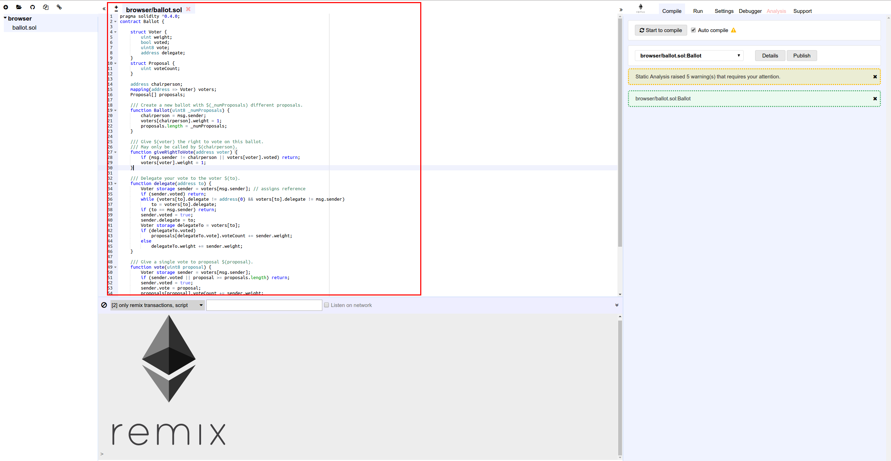

# Getting started with solidity

<!-- .slide: class="page-title" -->


## Summary

<!-- .slide: class="toc" -->

- [Blockchain key concepts](#/1)
- [Ethereum basics](#/2)
- **[Getting started with solidity](#/3)**
- [Truffle and smart contract deployment](#/4)
- [Unit testing on Truffle](#/5)
- [D-apps](#/6)
- [More on Solidity](#/7)
- [Introduction to Oracles](#/8)
- [Smart contract security and blockchain cost](#/9)
- [What's next on Ethereum](#/10)


## Solidity

<figure> 
    
</figure>

Notes :
From solidity doc :
Solidity is a contract-oriented, high-level language for implementing smart contracts. It was influenced by C++, Python and JavaScript and is designed to target the Ethereum Virtual Machine (EVM).

Solidity is statically typed, supports inheritance, libraries and complex user-defined types among other features.


## Pragma

Specify the solidity language version

```Javascript
pragma solidity ^0.5.4;
```

Last version is ^0.5.4


## Contract definition

```Javascript
contract HelloWorld {

}
```


## Variables : integer

```Javascript
contract HelloWorld {
    uint anUnsignedInteger = 400;
}
```

<!-- .element style="margin-top:50px"-->
**int8 to int 256/ uint8 to uint256**: Signed and unsigned integers of various sizes. Keywords uint8 to uint256 in steps of 8 (unsigned of 8 up to 256 bits) and int8 to int256. uint and int are aliases for uint256 and int256, respectively.

<!-- .element style="margin-top:50px"-->
**Operators**:

*Comparisons* : <=, <, ==, !=, >=, >

*Bit operators* : &, |, ^ (bitwise exclusive or), ~ (bitwise negation)

*Arithmetic operators* : +, -, unary -, unary +, \*, /, % (remainder),   \*\* (exponentiation), << (left shift), >> (right shift)


## Variables : addresses

**address**: Holds a 20 byte value (size of an Ethereum address). Address types also have members and serve as a base for all contracts.

<!-- .element style="margin-top:50px"-->
**Operators**:

<=, <, ==, !=, >= and >


## Variables : addresses

Members : 

- balance
- transfer
- call
- delegateCall
- send

<!-- .element style="margin-top:50px"-->
*Example :*
```Javascript
address x = 0x123;
address myAddress = this;
if (x.balance < 10 && myAddress.balance >= 10) x.transfer(10);
myAddress.call.gas(1000000).value(1 ether)("register", "MyName");
```

Notes : 
It is possible to query the balance of an address using the property balance and to send Ether (in units of wei) to an address using the transfer function

transfer : call the fallback function of the contract and send ether in a secure way. If the call fail, the transaction is reverted.

send : the transaction must be explicitely reverted in the send fail, you have to check for the returned value

call and delegatecall:  takes an arbitrary number of arguments of any type. These arguments are padded to 32 bytes and concatenated. The modifiers gas and value allow to specify a gaz number and send some ether with the transaction

delegatecall : same as called except that only the code of the given address is used, all other aspects (storage, balance, …) are taken from the current contract. The purpose of delegatecall is to use library code which is stored in another contract. 


## Variables : bool

**bool** : The possible values are constants **true** and **false**.

<!-- .element style="margin-top:50px"-->
**Operators** :

- ! (logical negation)
- && (logical conjunction, “and”)
- || (logical disjunction, “or”)
- == (equality)
- != (inequality)


## About fixed point number

Fixed point numbers are not fully supported by Solidity yet. They can be declared, but cannot be assigned to or from.

**fixed<M>x<N>**: signed fixed-point decimal number of M bits, 8 <= M <= 256, M % 8 ==0, and 0 < N <= 80

**ufixed<M>x<N>**: unsigned variant of fixed<M>x<N>.

**fixed, ufixed**: synonyms for fixed128x18, ufixed128x18 respectively.


## Variables : Fixed-size byte arrays

**bytes1**, **bytes2**, **bytes3**, …, **bytes32**. **byte** is an alias for **bytes1**.

<!-- .element style="margin-top:50px"-->
**Operators** :

- Comparisons: <=, <, ==, !=, >=, > (evaluate to bool)
- Bit operators: &, |, ^ (bitwise exclusive or), ~ (bitwise negation), << (left shift), >> (right shift)
- Index access: x[k] for 0 <= k < I returns the k th byte (read-only).


<!-- .element style="margin-top:50px"-->
**Members** :

- *.length* yields the fixed length of the byte array (read-only).


## Variables : Dynamically-sized byte array
**bytes** : Dynamically-sized byte array, see Arrays. Not a value-type!
**string** : Dynamically-sized UTF-8-encoded string, see Arrays. Not a value-type!


Notes: As a rule of thumb, use bytes for arbitrary-length raw byte data and string for arbitrary-length string (UTF-8) data. If you can limit the length to a certain number of bytes, always use one of bytes1 to bytes32 because they are much cheaper.


## Array

Arrays can have be fixed-sized or dynamic-sized.
```Javascript
pragma solidity ^0.4.16;
contract C {
    function f(uint len) public pure {
        uint[] memory a = new uint[](7);
        bytes memory b = new bytes(len);
        a[6] = 8;
    }
}
```


## Structs


## Mapping


## State variables visibility

- **public** : can be accessed by everyone. Solidity automatically generates a getter for a public variable.
- **internal**  (default): can only be accessed internally and only from the contract itself.
- **private** : can only be accessed internally and only from the contract itself.


## Enums 

```Javascript
contract test {
    enum ActionChoices { GoLeft, GoRight, GoStraight, SitStill }
    ActionChoices choice;
    ActionChoices constant defaultChoice = ActionChoices.GoStraight;

    function setGoStraight() public {
        choice = ActionChoices.GoStraight;
    }
}
```


## Solidity compiler

Solidity is a compiled language.
The solidity compiler, *solc* is a command-line program used like this : 

Print the compiled binary file :
```Bash
solc --bin sourceFile.sol
```

Output everything to separate files
```Bash
solc -o outputDirectory --bin --ast --asm sourceFile.sol
```

If your contract use a library : 
```Bash
solc -o outputDirectory --bin --ast --asm sourceFile.sol
```

Notes : 
The compiler can produce various outputs, ranging from simple binaries and assembly over an abstract syntax tree (parse tree).


## Natspec comment

Natspec comment are comments made using triple slashes : **///**
They can be used like regular comments (//) to comment the code.
But they will also be used to show the smart contract user a message while calling the contract.

Example : 
```Javascript
    /// Create a simple auction with `_biddingTime`
    /// seconds bidding time on behalf of the
    /// beneficiary address `_beneficiary`.
    constructor(
        uint _biddingTime,
        address _beneficiary
    ) public {
        beneficiary = _beneficiary;
        auctionEnd = now + _biddingTime;
    }
```


## Constructor
```Javascript
   constructor(
        uint _biddingTime,
        address _beneficiary
    ) public {
        beneficiary = _beneficiary;
        auctionEnd = now + _biddingTime;
    }
```


## Function

```Javascript
function (<parameter types>) {internal|external} [pure|constant|view|payable] [returns (<return types>)]
```

Functions can be assigned to variables and pass to other function, like in Javacript.

Lambda or inline functions are planned but not yet supported.

Notes :
internal/external : 
Internal functions can only be called inside the current contract (more specifically, inside the current code unit, which also includes internal library functions and inherited functions) because they cannot be executed outside of the context of the current contract. Calling an internal function is realized by jumping to its entry label, just like when calling a function of the current contract internally.

External functions consist of an address and a function signature and they can be passed via and returned from external function calls.

Functions are internal by default.


## Method visibility 

- **public** - all can access
- **external** - Cannot be accessed internally, only externally
- **internal** - only this contract and contracts deriving from it can access
- **private** - can be accessed only from this contract

Notes : if your method is only called externally, use external every time, as it costs less gaz (the method parameters aren't copied in memory).


## Inherance


## If


## For


## Remix IDE

The best option to quickly test Solidity :

Online editor : https://remix.ethereum.org/

Can also be installed locally.


## Remix IDE - Solidity Editor
<figure> 
    
</figure>

Allow you to easily : 

- write and compile a smart contract

- test it using solidity test cases

- deploy it on a ethereum network

- debug it


## Remix IDE - Demo

<!-- .element style="margin-top:150px"-->
<figure> 
    
</figure>

Notes : 
Here’s the list of some important features:

Solidity editor : 
It display opened files as tabs.
Remix saves the current file continuously (5s after the last changes)
+/- on the top left corner enable you to increase/decrease the font size of the editor

Smart contract compilation : 
Compilation Warning and Error are displayed in the gutter
Autocompile every 5 seconds
Publishing your contract to Swarm (decentralized file system)

Javascript VM : 
RemixIDE can simulate an Ethereum network thought a Javascript VM


## Our common goal during this training

A D-App allowing users to gamble on football matchs in a decentralized fashion.


## The result
<!-- .element style="margin-top:150px"-->
<figure> 
    
</figure>


# TP - First smart contract on Remix IDE

<!-- .slide: class="page-tp2" -->


