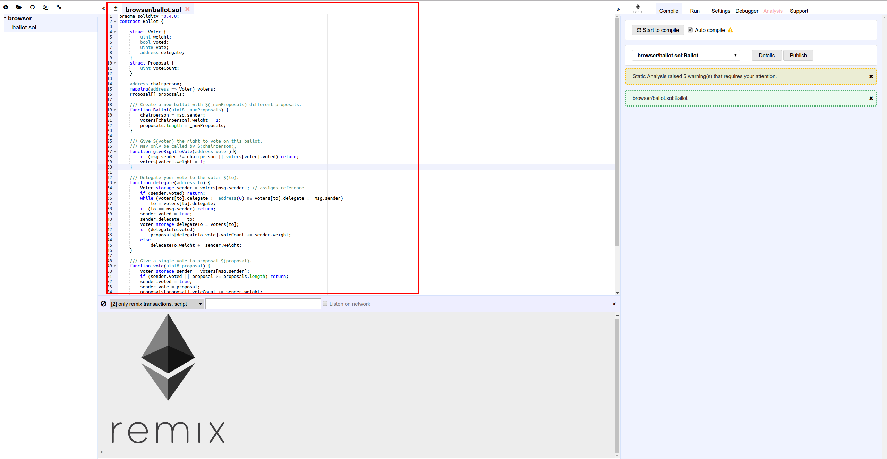

# Tooling

<!-- .slide: class="page-title" -->

## Summary

<!-- .slide: class="toc" -->

- [Blockchain key concepts](#/1)
- [Ethereum basics](#/2)
- [Getting started with solidity](#/3)
- **[Tooling](#/4)**
- [Unit testing on Truffle](#/5)
- [More on Solidity](#/6)
- [Deploy your smart contract](#/7)
- [Oracles](#/8)
- [Decentralised hosting](#/9)
- [On smart contract security](#/10)
- [What's next on Ethereum](#/11)

## Ganache

Quickly create a test blockchain, with some account already initialized and alimented with ether, linked to a block explorer to check te results of your tests.

## Remix IDE

The best option to quickly test Solidity :

Online editor : https://remix.ethereum.org/

Can also be installed locally.

## Remix IDE - Solidity Editor
<figure> 
    
</figure>

Allow you to easily : 

- write and compile a smart contract

- test it using solidity test cases

- deploy it on a ethereum network

- debug it

## Remix IDE - Demo

<!-- .slide: class="page-demo" -->

## Truffle

A framework which simplify a lot the deployment, unit testing

## Metamask

## Ganache

A test blockchain for your development environment.
Available on cli or GUI
The GUI has a useful block explorer

## Metamask limitations

The web3 object is stored in the global windows objet. It means that another website can access this object from your browser. It's very dangerous and unsecure. Never use Metamask with a real ethereum account.

# Web3 js

<!-- .slide: class="page-questions" -->

<!-- .slide: class="page-tp4" -->
