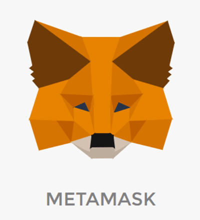

# Tooling

<!-- .slide: class="page-title" -->

## Summary

<!-- .slide: class="toc" -->

- [Blockchain key concepts](#/1)
- [Ethereum basics](#/2)
- [Getting started with solidity](#/3)
- **[Tooling](#/4)**
- [Unit testing on Truffle](#/5)
- [More on Solidity](#/6)
- [Deploy your smart contract](#/7)
- [Oracles](#/8)
- [Decentralised hosting](#/9)
- [On smart contract security](#/10)
- [What's next on Ethereum](#/11)

## Ganache

Quickly create a test blockchain, with some account already initialized and alimented with ether, linked to a block explorer to check te results of your tests.

<!-- .slide: class="page-demo" -->

## Remix IDE

The best option to quickly test Solidity :

Online editor : https://remix.ethereum.org/

Can also be installed locally.

## Remix IDE - Solidity Editor
<figure> 
    
</figure>

Allow you to easily : 

- write and compile a smart contract

- test it using solidity test cases

- deploy it on a ethereum network

- debug it

## Remix IDE - Demo

<!-- .slide: class="page-demo" -->

## Truffle

A framework which simplify a lot the smart contract development.

<!-- .element style="margin-top:50px"-->
It provides tooling to :

- manage your smart contract lifecycle
- automate your smart contract testing
- automate and script your smart contract deployment and migrations
- handle simply multiple ethereum network
- provide other tools like an interactive console and an external script runner

Notes :
Manage your smart contract lifecycle =>
Truffle takes care of managing your contract artifacts so you don't have to. Includes support for custom deployments, library linking and complex Ethereum applications.

Automate your smart contrac testing =>
Provide a test suite to unit test your SM in both JavaScript and Solidity

Automate and script your smart contract deployment and migrations =>
Allow you to write simple, manageable deployment scripts that acknowledge your application will change over time.

Handle simply multiple ethereum network =>
Don't manage network artifacts ever again. Let Truffle do it for you, and put your focus on dapp development where it belongs.

## Metamask

MetaMask is the easiest way to interact with dapps in a browser. It is an extension for Chrome or Firefox that connects to an Ethereum network without running a full node on the browser's machine. It can connect to the main Ethereum network, any of the testnets (Ropsten, Kovan, and Rinkeby), or a local blockchain such as the one created by Ganache or Truffle Develop.

<figure> 
    
</figure>

## Metamask limitations

The web3 object is stored in the global windows objet. It means that another website can access this object from your browser. It's very dangerous and unsecure. Never use Metamask with a real ethereum account.

# Web3 js

<!-- .slide: class="page-questions" -->

<!-- .slide: class="page-tp4" -->
