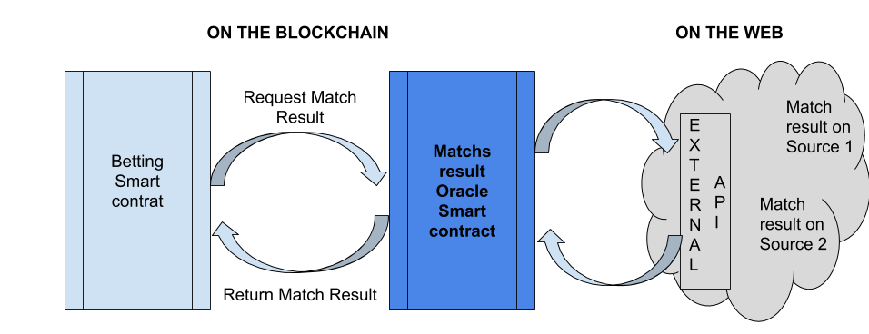

# Oracles

<!-- .slide: class="page-title" -->


## Sommaire

<!-- .slide: class="toc" -->

- [Blockchain key concepts](#/1)
- [Ethereum basics](#/2)
- [Getting started with solidity](#/3)
- [Truffle and smart contract deployment](#/4)
- [Unit testing on Truffle](#/5)
- [D-apps](#/6)
- [More on Solidity](#/7)
- **[Introduction to Oracles](#/8)**
- [Smart contract security and blockchain cost](#/9)
- [What's next on Ethereum](#/10)


## The problem

Smart contracts insures the unbiaised execution of all instructions coded into them.

<!-- .element style="margin-top:50px"-->
Those instructions often use on-chain datas but the usage of smart contract would be very limited without datas from the real, off-chain world (price feed, weather information, sports matches result for betting smart contract). 

<!-- .element style="margin-top:50px"-->
Enter the Oracles.


## Definition of an Oracle

<!-- .element style="margin-top:50px"-->
Oracles are entities that retrieve and verify the external world information for a smart contract.

<!-- .element style="margin-top:50px"-->
They are an interface between the blockchain and the real world.


## Properties of an Oracle

- Trustworthy
- Consistent through time
- (Decentralized)

Notes : 
Trustworthy : the datas provided by an Oracle are driving the execution of the code on the smart contract. If thoses datas are corrupted or inaccurate, the smart contract is, in turn, corrupted and inaccurate. 


## The Oracle forsees some difficulties

A Oracle which is 100% centralized is a critical flaw of design for a smart contract because it  invalidates the whole decentralized paradigm.

<!-- .element style="margin-top:50px"-->
If a smart contract Oracle gets corrupted and send false datas, the smart contract is corrupted.

<!-- .element style="margin-top:50px"-->
Therefore, Oracles are smart contracts weak links because they are no longer trustless, their users should trust their Oracles.

<!-- .element style="margin-top:50px"-->
In a blockchain environnement, people tends to trust full decentralization with incentives guaranting the honesty of the peers over centralization.

<!-- .element style="margin-top:50px"-->
Unfortunately, in Oracles case, there is no way to guarantee an information from the real world without trusting one or several third parties who will assert that the information received is correct and convey the actual state of the real world. 

Notes :
Specifically, in the context of tethering physical assets to the blockchain, oracles are not capable of providing trustless verification that ownership of an asset such as a house is actually transferred to the new owner, even if the new owner holds a token representing ownership on the blockchain. Possession in a smart contract does not always transfer to possession in the real-world, thus removing the killer application of smart contracts, trustless execution. This is a result of the smart contract needing to rely on some third-party verification of the events in the real world, in the form of an oracle.


## Software oracles

Software Oracles are the most common form that pull data from third-party sources such as web APIs and can include real-world information like flight statuses and weather data.

<!-- .element style="margin-top:50px"-->
Among them are Consensus Oracles. 
Consensus Oracles represent a step towards decentralized oracles and rely on aggregating data from several oracles with proprietary methods for determining their authenticity and accuracy.


## Hardware oracles

Hardware Oracles are sensors integrated with tangible physical objects. Primary examples would be in supply chain tracking with the use of RFID tags for feeding data like environmental conditions of products to the blockchain.

<!-- .element style="margin-top:50px"-->
<figure> 
    
</figure>


## Oracles usage :  Outbund ou Inbound 

Outbound Oracles allow smart contracts to send data to sources outside of the blockchain network they exist on.

<!-- .element style="margin-top:50px"-->
Inbound Oracles allow smart contracts to react to specific data. 'If I get this price to the oracle then this action gets triggered.'


## Oracle services : Chainlink

Chainlink : offchain middleware providing link between blokchains and numerous individual Oracles some of same providing the same information and each of them having its own SLA and reputation. When a request is made, all Oracles matching the requested SLA and able to respond are interrogated, and their responses are aggrated into the most trustworhty response.


## Oracle services : Oraclize 

<figure> 
    
</figure>


## Oraclize example

```Javascript
pragma solidity ^0.4.19;
import "./Oraclize.sol";

contract SimpleOraclizeContract is usingOraclize {

    string public ETHXBT;

    function SimpleOraclizeContract() payable {
    }

    function __callback(bytes32 myid, string result) {
        if (msg.sender != oraclize_cbAddress()) revert();
        ETHXBT = result;
    }

    function updatePrice() payable {
        if (oraclize_getPrice("URL") > this.balance) {
            LogNewOraclizeQuery("Oraclize query was NOT sent, please add some ETH to cover for the query fee");
        } else {
            LogNewOraclizeQuery("Oraclize query was sent, standing by for the answer..");
            oraclize_query("URL", "json(https://api.kraken.com/0/public/Ticker?pair=ETHXBT).result.XETHXXBT.c.0");
        }
    }
}
```